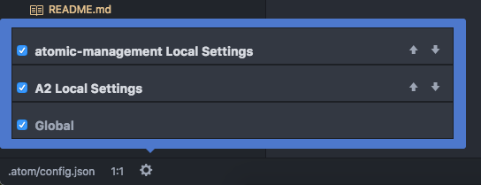

# Atomic Management
Per-project Atom text editor configurations, for each window.

## Prerequisites
**Requires Atom v1.26 or above.** This package **will not** work with older versions of Atom.

## Installation

* In Atom, open *Preferences* (*Settings* on Windows)
* Go to the *Install* section
* Search for `Atomic Management` and click `Install`.

Or through the command line:

```
apm install atomic-management
```

## Usage
When a project directory is loaded, Atomic Management will look for a
`.atom/config.cson` or `.atom/config.json` file in the opened directory. If no such
file is found, global configurations are used (as per usual). If a project file
is found, it is loaded as Project Configurations and will override the global
configuration when in the project's context.

This allows users to configure visual settings (font size, color, themes),
disable packages, modify settings for other packages, etc. on a per-project
basis *without* tampering with global configurations.

Users can begin using this package immediately after installation with no
additional configuration other than the creation of the `.atom/config.cson` or
`.atom/config.json` file. If you encounter issues, please submit a GitHub issue
with as many details as possible.

## Per-Project Config files: How to
The `.atom/config.cson` or `.atom/config.json` file should be specified in a syntax
similar to the global config file. An example is shown below.

```
"*":
    core: {
        themes: [
            "one-light-ui",
            "one-light-syntax"
        ]
        disabledPackages: [
            "markdown-preview"
        ]
    }
    editor: {
        fontSize: 15
        tabLength: 4
    }
    "bracket-matcher":
        autocompleteBrackets: true

".text.html.php":
    editor:
        tabLength: 8
    "bracket-matcher":
        autocompleteBrackets: false

".source.python":
    editor:
        tabLength: 2
```

This package supports all Atom configurations, including but not limited to:

- Specifying settings for the global namespace `*` (affects all files) or
  settings that only affect individual filetypes
    - See [here](https://flight-manual.atom.io/using-atom/sections/basic-customization/#finding-a-languages-scope-name)
      for instructions on how to find a language's scope name.
- `core` and `editor` settings
    - Themes
    - Packages to disable
- Package-specific configurations, such as those of the `bracket-matcher`
  package

For a full list of configurable content, please see the official Atom
documentation [here](https://flight-manual.atom.io/using-atom/sections/basic-customization/#configuration-key-reference).

Features that pertain explicitly to styling, such as font color, can be changed
by creating themes and placing them in the `core` array. See
[here][creating-a-theme] for more details on creating themes.

[creating-a-theme]: https://flight-manual.atom.io/hacking-atom/sections/creating-a-theme/

## Additional Features

### Status Bar
When local configuration files are active, a gear icon will appear on the lower
left side of the Atom window. When clicked, this status bar button will display
the local configuration files that are currently active and allow you to
activate, deactivate, or rearrange the order of the local project
configurations.



## FAQ
- [How do per-project config files interact with the global config?](#how-do-per-project-config-files-interact-with-the-global-config)
- [How do I reset my choice of which per-project config file to use?](#how-do-i-reset-my-choice-of-which-per-project-config-file-to-use)
- [How do I tell which per-project config file is currently in effect?](#how-do-i-tell-which-per-project-config-file-is-currently-in-effect)
- [Can different keybindings be set with this package?](#can-different-keybindings-be-set-with-this-package)

### How do per-project config files interact with the global config?
The settings described in the `.atom/config.cson` or `.atom/config.json` file
will override the global Atom configuration, and each operates independently of
each other.

If you wish to change settings on a per-project level, directly edit/create the
`.atom/config.cson` or `.atom/config.json` under the project's root directory. If
you wish to change global settings, directly edit the global configuration
either through `Edit > Config` on Windows/Linux or `Atom > Config` on Mac.

### How do I reset my choice of which per-project config file to use?
In `Packages > Atomic Management`, select the option `Reset Remembered Config`.

### How do I tell which per-project config file is currently in effect?
You can quickly open up the active per-project config file by selecting
`Packages > Atomic Management > Open Active Config File`.

### Can different keybindings be set with this package?
No. This package only manages settings that are available through Atom's global
`config.cson` file. Atom manages keybindings through a separate keymap.cson
file.
